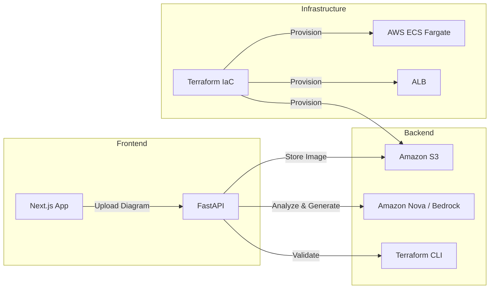

# Nova Architect — Diagram to Terraform

> Upload architecture diagrams and let **Amazon Nova AI** generate production-ready Terraform code instantly.

## Architecture



## Tech Stack

| Layer          | Technology                     |
| -------------- | ------------------------------ |
| Frontend       | Next.js 14, React, Tailwind CSS |
| Backend        | Python, FastAPI, Uvicorn       |
| AI Service     | Amazon Nova (via Bedrock API)  |
| Storage        | Amazon S3                      |
| IaC            | Terraform                      |
| Container      | Docker, ECS Fargate            |
| Load Balancer  | AWS ALB                        |

## Project Structure

```
Aws_nova_project/
├── backend/
│   ├── main.py              # FastAPI application
│   ├── requirements.txt     # Python dependencies
│   └── Dockerfile
├── frontend/
│   ├── src/app/
│   │   ├── globals.css      # Amazon Nova themed styles
│   │   ├── layout.tsx       # Root layout
│   │   └── page.tsx         # Main application page
│   ├── tailwind.config.ts   # Nova color palette
│   ├── next.config.js
│   ├── tsconfig.json
│   ├── package.json
│   └── Dockerfile
├── infrastructure/
│   ├── main.tf              # VPC, S3, ECR, ECS, ALB, IAM
│   ├── variables.tf
│   └── outputs.tf
├── docker-compose.yml       # Local development
└── README.md
```

## Getting Started

### Prerequisites

- **Node.js** 20+
- **Python** 3.11+
- **Docker** & Docker Compose
- **AWS CLI** configured with Bedrock access
- **Terraform** 1.5+

### Local Development

1. **Clone the repository**
   ```bash
   git clone <repo-url>
   cd Aws_nova_project
   ```

2. **Backend** (manual)
   ```bash
   cd backend
   python -m venv venv
   source venv/bin/activate
   pip install -r requirements.txt
   uvicorn main:app --reload --port 8000
   ```

3. **Frontend** (manual)
   ```bash
   cd frontend
   npm install
   npm run dev
   ```

4. **Docker Compose** (all-in-one)
   ```bash
   # Set your AWS credentials in the environment
   export AWS_ACCESS_KEY_ID=<your-key>
   export AWS_SECRET_ACCESS_KEY=<your-secret>
   docker compose up --build
   ```

### Deployment

1. **Provision infrastructure**
   ```bash
   cd infrastructure
   terraform init
   terraform plan
   terraform apply
   ```

2. **Push container images**
   ```bash
   # Authenticate Docker to ECR
   aws ecr get-login-password --region us-east-1 | \
     docker login --username AWS --password-stdin <account>.dkr.ecr.us-east-1.amazonaws.com

   # Build and push
   docker build -t nova-architect-backend ./backend
   docker tag nova-architect-backend:latest <ecr-backend-url>:latest
   docker push <ecr-backend-url>:latest

   docker build -t nova-architect-frontend ./frontend
   docker tag nova-architect-frontend:latest <ecr-frontend-url>:latest
   docker push <ecr-frontend-url>:latest
   ```

## API Endpoints

| Method | Endpoint                    | Description                          |
| ------ | --------------------------- | ------------------------------------ |
| GET    | `/api/health`               | Health check                         |
| POST   | `/api/upload`               | Upload a diagram image               |
| POST   | `/api/analyze/{diagram_id}` | Analyze diagram with Amazon Nova     |
| POST   | `/api/generate/{diagram_id}`| Generate Terraform from analysis     |
| POST   | `/api/validate`             | Validate Terraform HCL              |

## License

MIT
